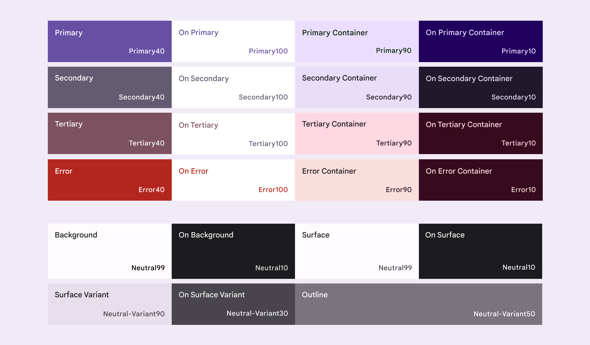

# UX TIPS

## Color Tips

from https://www.youtube.com/watch?v=C1rQQ_YpgcI

### Color Harmonies

Basat en la posició que ocupen a la roda de colors tenim:
Monochromatic, complementary (oposat), Analogous (adjacents).

### Neutral Colors

Are like the supporting cast for your lead colors. They can be warm, cool, light or dark,
and they tend to recede into the background leaving room for your big bold color choices.
The most common neutral colors are blacks, whites, grays and browns.

### Less is more

Avoid using a lot of vibrant colors. Think about the mood you want to create.
Start with two colors and maybe two neutrals. You can always add more later.

### Contrast

The way your image looks in grayscale it will determine how it looks in full color.
Lightness is almost more important than the color itself because **without enough
light and dark contrast your image will be lost**. Low contrast is a great way to
frustrate and alienate people from your work. Specially when typography is involved.
**Look how the colors you picked look in grayscale.**

### Aim for Balance
CONTRAST, QUANTITY and USAGE

Neutral colors are like the rhythm section of a song.

*60-30-10 Rule*: Use your `Primary` 60% of the time. `Secondary` 30% (can be more
than one color) and the `Accent` color for the last 10%.
(https://www.youtube.com/watch?v=eXcKOqviLE0)

It's hard. You want harmonious colors, room to breath and plenty of contrast.

Be consistent in the way you use your colors to avoid confusing the viewer.

## Colors I like

### Material 3
https://m3.material.io/styles/color/the-color-system/key-colors-tones
#### Roles

#### Tokens

