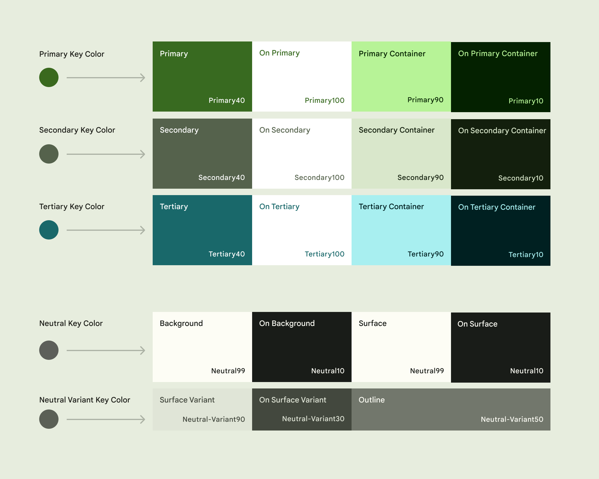
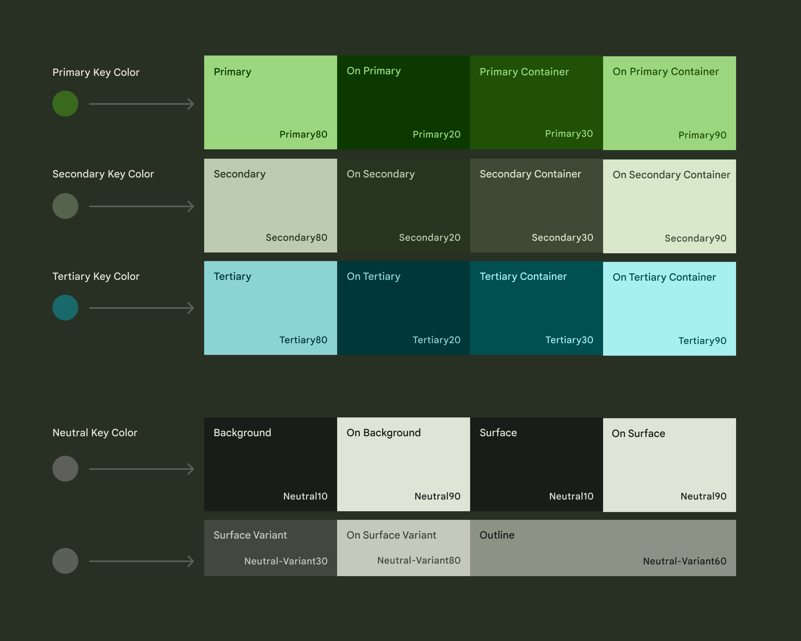

# Blueprint sketch

## De què anirà la vostra app

Un wishlist on steroids de pel·lícules, sèries, llibres o articles

## Qui problema resol?

Explotar la FOMO que molts portem dins respecte al consum cultural.
Deixar de perdre el temps donant voltes i més voltes a la corrua de continguts
oferts per les diferents plataformes de continguts.

O bé el seu Algorisme no funciona perquè respon a altres interessos més enllà
del teu gust particular o bé no té prou contingut de qualitat.
En qualsevol cas, la millor guia són el boca-orella i les recomanacions de gent
que et coneix o amb qui hi ha certa afinitat de gustos.

Sovint em passa que quan tinc algun temps mort no sé què mirar, tot i saber que
algú en algun moment em va recomanar tal sèrie o llibre. Però soc incapaç de
recordar què era ni si és el més adequat pel temps que disposo.

## Quina API hauria de consumir?

N'he anotat algunes però sense mirar res a fons.

- https://www.themoviedb.org/documentation/api
- https://simkl.docs.apiary.io/
- http://www.goodreads.com/api
- https://developers.google.com/books

### API de TMDB

D'entrada ens limitarem a usar l'api de themoviedb.  
Suporta CORS.

Més informació a [External API](#apis-externes)

## Quin serà el seu usuari habitual?

Un diagrama de Venn mostrant la intersecció entre geeks, content junkies i
keyboard workflow lovers.

## Quines característiques i funcionalitats tindrà?

### Disseny

Es vol implementar un `SPA` molt simple.

- [UX](#user-experience)
- [Architecture](#arquitectura)

### Resum

- Cercador tipus omnibox que permeti agregar el contingut a la llista d'una
  forma ràpida. Ha de ser pràctic, treure el mòbil/desktop i notar amb una o
  dues interaccions.
- Afegir anotacions al contingut, referències sobre qui l'ha recomanat
- Seguiment de capítols
- Recomanacions en funció del temps disponible, mood, gènere.
- Arxivar contingut
- Afegir noves fitxes de contingut mitjançant enllaços
- Local storage amb objectes ben estructurats. [Notes Storage](#remote-storage)

### TODO (long term)

#### Sync

Usar Firebase per mantenir les dades sincronitzades entre dispositius.
[Notes Storage](#remote-storage)

#### Social

El component social: Integració amb altres serveis com goodreads, themoviedb,
simkl.com o youtube

## Notes

#### Remote Storage

Planteja el projecte usant local storage i posa com a ampliació / línia
futura la integració amb Firebase pel tema de sincronitzar entre dispositius.
Si hi ha temps a fer la part de Firebase, bravo. Si no, igualment tens una
webapp funcionant bé.

A banda, si el tema local storage el fas amb objectes ben estructurats, després
tens una part del camí recorregut per Firebase. I a banda, afegir Firebase no
impedeix que t'interessi igualment tenir local storage, perquè així l'aplicació
pugui sempre funcionar en local encara que no tingui connexió a Internet i fer
posteriorment les sincronitzacions quan en torni a tenir.

# Arquitectura

- S'utilitza un stack amb Vanilla JavaScript, CSS i HTML, localStorage i IndexDB.
- S'estructura el codi utilitzant el patró MVC més serveis, repositoris i DTO's.
- S'intenta utilitzar un JS idiomàtic, evitant l'ús de classes, i documentar les
  funcions i objectes amb Type Annotations.

## Discussions

- [Com injectar part d'un fitxer html mitjançant JS correctament? (2022-05-12)](https://cifovirtual.cat/mod/forum/discuss.php?d=9426)

## Principles

- [Clean Code](https://gist.github.com/wojteklu/73c6914cc446146b8b533c0988cf8d29)

# Apis Externes

## API de TMDB

### Suporta CORS

```http
access-control-allow-origin     *
access-control-allow-methods    GET, HEAD, POST, PUT, DELETE, OPTIONS
```

### Documentació sobre l'endpoint a usar:

https://developers.themoviedb.org/3/search/multi-search  
https://api.themoviedb.org/3/search/multi?api_key={API_KEY}&query=severance  
La idea és fer una query que retorni tan resultats de pel·lícules, sèries i
actors per anar filtrant posteriorment en local.

### Àmbit d'acció

D'entrada es vol limitar el desenvolupament del projecte a l'ús d'un sol endpoint
de l'api de themoviedb. Amb això n'hi ha prou per dissenyar la funcionalitat
de tota l'app i reutilitzar els diferents components quan vulguem ampliar
els serveis que hagi d'oferir.

Al final, però, s'utilitzen tres endPoints més, un per cada tipus de resultat que
torna l'EndPoint de `multi-search`. De manera que quan una cerca torna els resultats 
amb informació resumida per cada contingut, es pugui fer una segona petició a 
l'endpoint corresponent, en funció del tipus, per emmagatzemar informació extra.

# User Experience

Disseny molt simple d'una sola pàgina amb diferents seccions que s'aniran carregant
de forma dinàmica.

## Home

S'opta per un disseny molt simple on prendran gran protagonisme les seccions de
contingut i la caixa de cerca.

La idea és amagar els menus i que les funcionalitats es vagin trobant de manera
fluida.

La `Home` consta bàsicament d'un `header` amb el logo, una gran caixa de cerca
`omnibox` i l'avatar de l'usuari.

## Header

### Logo

És bàsicament black text

### Omnibox

L'[Omnibox](#omnibox) Apareixerà amb un element distintiu a la part interior
esquerra per indicar a quina secció es troba.  
Un text centrat que dirà `< Go to | Search >` i una icona awesome d'una lupa a la dreta.

Quan es cliqui sobre la caixa es desplegarà per mostrar els controls.

### User Avatar

L'avatar es tractarà de capturar per gravatar quan l'usuari faciliti el mail.
En cas de no trobar-se constarà d'un cercle amb les inicials i un color random.

## Main

Les seccions tindran una disposició horitzontal per contenir tants [cards](#cards)
com es pugui.  
Cada `card` representarà una peça de contingut associada a la seva
plana de detall corresponent.

### Search Results

### Watching

### TV

### Movies

## Omnibox

Té dues funcions principals, **substituir el menú tradicional** i **cercar
contingut**, tant local com remot, entre les diferents seccions de la web.

Es pot entendre com una mena de LaunchBar/Quicksilver al navegador.

A la part interior esquerra de l'Omnibox apareixerà la `secció actual`.

La secció per defecte serà [HOME](#home) i executarà una `cerca global`.

En clicar sobre la secció es desplega l'omnibox per mostrar el llistat de
`seccions disponibles`.

Quan l'omnibox tingui el focus capturarà les tecles `Up/Down` per seleccionar la
secció sobre la qual s'executarà la cerca.

Es passarà el focus a l'`input` quan es detecti qualsevol altra tecla alfanumèrica
o bé quan s'hagi clicat sobre una secció.

L'acció de seleccionar una secció altera el `títol` i el `main` de la pàgina.
Amagant o eliminant la resta de seccions.

Ha de ser fàcilment usable tant per teclat, ratolí o touch.

La `cerca s'executarà` al prémer enter o quan la cadena de caràcters tingui una
mida suficient (a determinar) per efectuar-la.

## Cards

...

## Details

...

# Recerca

- Es revisen aquelles solucions existents que coincideixin d'alguna manera amb
  l'àmbit del projecte.
- S'ignoren tots aquells aspectes, funcionalitats o serveis que no hi coincideixin,
  però s'anoten els que poguessin arribar a ser d'interès.

## UX de TMDB

### Funcionalitats disponibles

- `cercador`: cercador de continguts
- `llistes de preprodució personals`: permet crear llistes de reproducció a discreció
- `watchlist`: contingut sobre el qual estar pendent
- `puntuacions`: valoracions sobre el contingut vist
- `favorits`: llista de contingut favorit
- `recomanacions`: suggeriments que fa TMDB en funció de _¿la nostra interacció amb la plataforma?_
- `discusions`: discussions tipus slack sobre el contingut
- `streaming`: indicar a quins serveis de streaming estem subscrits o interessats

### Continguts

Des de la fitxa de continguts es pot interactuar amb qualsevol de les funcionalitats
disponibles i accedir a informació extra sobre el mateix.

- `temporades`
- `capítols`: pot donar-se el cas que aquesta informació no estigui disponible (**problema**).
- `WatchNow`: Mitjançant l'API de `JustWatch`, i en funció de la localització de l'usuari,
  s'informa de la plataforma que emet el contingut.

## JustWatch

...

## UX TIPS

## Color Tips

from https://www.youtube.com/watch?v=C1rQQ_YpgcI

### Color Harmonies

Basat en la posició que ocupen a la roda de colors tenim:
Monochromatic, complementary (oposat), Analogous (adjacents).

### Neutral Colors

Are like the supporting cast for your lead colors. They can be warm, cool, light or dark,
and they tend to recede into the background leaving room for your big bold color choices.
The most common neutral colors are blacks, whites, grays and browns.

### Less is more

Avoid using a lot of vibrant colors. Think about the mood you want to create.
Start with two colors and maybe two neutrals. You can always add more later.

### Contrast

The way your image looks in grayscale it will determine how it looks in full color.
Lightness is almost more important than the color itself because **without enough
light and dark contrast your image will be lost**. Low contrast is a great way to
frustrate and alienate people from your work. Specially when typography is involved.
**Look how the colors you picked look in grayscale.**

### Aim for Balance

CONTRAST, QUANTITY and USAGE

Neutral colors are like the rhythm section of a song.

_60-30-10 Rule_: Use your `Primary` 60% of the time. `Secondary` 30% (can be more
than one color) and the `Accent` color for the last 10%.
(https://www.youtube.com/watch?v=eXcKOqviLE0)

It's hard. You want harmonious colors, room to breath and plenty of contrast.

Be consistent in the way you use your colors to avoid confusing the viewer.

## Colors I like

### Material 3

https://m3.material.io/styles/color/the-color-system/key-colors-tones

#### Roles

|                                  Material 3 Roles light                                  |                                 Material 3 Roles dark                                  |
| :--------------------------------------------------------------------------------------: | :------------------------------------------------------------------------------------: |
|  |  |

#### Tokens

|                                  Material 3 Tokens light                                   |                                       Material 3 Tokens dark                                       |
| :----------------------------------------------------------------------------------------: | :------------------------------------------------------------------------------------------------: |
|  |  |

# CHANGELOG

## Temps invertit
| Hores   | Tipus   | Inici      | Fi |
|---------|---------|------------|----|
| 11h 33m | planning | 2022-04-07 | 2022-04-25|
| 32h 08m | desing  | 2022-04-25 | 2022-05-27|
| 39h 47m | devel   | 2022-05-31 |  2022-06-29|
| 3h 27m  | memo    | 2022-04-07 | 2022-06-29|
**86h 55m Total**


Diari sobre el procés de planificació i desenvolupament

## (2022-06-29) Retocs i Documentació

- Es mou el codi produït en copiar la carta de Kevin Powell al seu propi projecte
  [github/jfpla/card-exercise](https://github.com/jfpla/card-exercise).
- S'afegeixen funcions per eliminar els items guardats al WatchList.
- Es retoca la capçalera de l'app. Allà on resideix la caixa de cerca.
- S'elimina el NavigatorController perquè no hi ha temps a implementar la seva
  funcionalitat.
- Es reprèn la feina de documentació.

## (2022-06-28) Integració de la Card de Kevin Powell

- Es refactoritza l'HTML i estils de la carta per adaptar-la al nostre cas d'ús.
- Quan l'API no torna imatges se n'afegeixen unes genèriques de tipus placeholder.
- S'afegeixen icones FontAwesome per distingir el tipus de resultats.
- Es mostren les estadístiques del contingut.
- S'arreglen bugs relacionats amb com es carreguen els assets.
- Es refactoritza el controlador de la carta.
- S'afegeixen noves taules a la DB per emmagatzemar dades extra sobre els diferents
  tipus de contingut.
- S'afegeixen noves funcions al repositori per gestionar les dades.
- S'afegeix un botó per guardar a la DB informació extra sobre el contingut
  mitjançant nova crida a l'API.
- El botó, a part d'executar la consulta contra la DB o l'API, passa un callback
  a les funcions del repositori per modificar el seu estil quan la transacció
  s'ha acabat.

## (2022-06-22) Es comença a copiar la Card de Kevin Powell

- Es decideix utilitzar un sol EvenListener a l'Omnibox controller. Abans
  s'escoltaven "change" i "input" però donava molts maldecaps.
- A mesura que progressa el [video de Kevin Powell](https://www.youtube.com/watch?v=YmyqlM13JUU),
  es va copiant i jugant amb el codi.
  En abusar tant de posicions absolutes entre les diferents capes de la carta,
  s'ha d'anar reajustant el CSS perquè les imatges que farem servir tenen proporcions
  diferents de les de l'exemple.
- S'intenta animar el SVG del background mitjançant CSS enlloc de definir l'animació
  al mateix SVG, però no queda tan bé. Es tracta de modificar l'SVG

## (2022-06-12) SearchResultsView elimina els resultats anteriors

- Abans de tornar a construir la vista de resultats, s'assegura d'haver eliminat
  els anteriors.

## (2022-06-11) Components SearchResults i Card

- Una primera aproximació als components SearchResults i Card per començar a pintar
  resultats.
- Es refactoritza la funció que carrega l'HTML per tenir més flexibilitat en
  inserir els Cards dins el SearchResults.
- S'afegeixen els controladors corresponents als components anteriors per pintar
  les dades.
- El controlador de la cerca s'invoca indirectament mitjançant una high order function
  que serà usada com a callback quan es dispara la cerca.

## (2022-06-10) Experimentant amb IndexedDB

- Setup de la DB
- Omnibox recupera resultats de la DB quan hi són i en cas contrari els guarda després
  de cridar a l'API

## (2022-05-31) TMDB DTOs, Type annotations and view callback experiment

- Es comencen a estructurar els DTO's de l'API i les relacions entre ells
- S'hi afegeixen Type Annotations. Molt més tard es descobrirà que només són útils per
  documentar i ajudar a l'editor a auto completar les propietats dels DTO. El typeof no
  serveix per conèixer el tipus d'objecte en temps d'execució.
- S'experimenta amb la creació d'una funció callback high order per cridar a la vista

## (2022-05-27) Es comença a programar el funcionament de l'Omnibox

- OmniboxController utilitza el mecanisme de throttling per minimitzar les
  crides a l'API externa i obtenir resultats a mesura que l'usuari va escrivint.
- Es crea l'esquelet del Navigator a partir d'un enum que defineix les seves
  seccions.

## (2022-05-18) Es fixa l'arquitectura a MVC + Serveis

- Les vistes van a buscar el seu html i css i el carreguen al dom.
- Els controladors van a buscar les vistes i, si cal, manipulen la vista.
- La capa de models encara està per dissenyar.
- Els serveis són els encarregats d'atacar les API externes i storage.
- S'utilitzen DTO's per definir la forma de les dades que retornen les API.

## (2022-05-12) Es juga amb l'estructura del projecte

## (2022-04-27) Planning development and deploy

- Planificant quina estructura tindrà l'arbre de directoris
- Quin serà l'`entrypoint` del projecte per desenvolupar en local
- Com es resoldrà el problema dels URL paths d'un `SPA` en local
- I com `debugar`

## (2022-04-26) Learning how to start a vanilla JS project

## (2022-04-25) UX design

- Es descriu el funcionament de `Home` i `Omnibox`

## (2022-04-25) UX design

- Es comença a dissenyar la pàgina principal emfatitzant la caixa de cerca
  omnibox amb [Figma](https://www.figma.com/file/u55CZr72i0HtHgYXoYcBPf/FOMO).

## (2022-04-24) UX inspiration

- S'han remenat al voltant d'uns 15 dissenys a figma i dribble

## (2022-04-23) UX: Notes sobre disseny

- Recerca sobre com escollir colors

## (2022-04-22) API research i UX

- S'opta per començar el projecte atacant un sol endpoint de l'API de TMDB.
- Es comença la recerca d'UX revisant projectes existents.
- Es remenen dissenys tipus IMDB a dribbble.com
- Es miren implementacions CSS de cards a youtube

## (2022-04-20) API research

- Es remena la documentació i l'API de TheMovieDB.

## (2022-04-07) Blueprint sketch & API research

- Es fa un primer esbós sobre l'abast del projecte.
